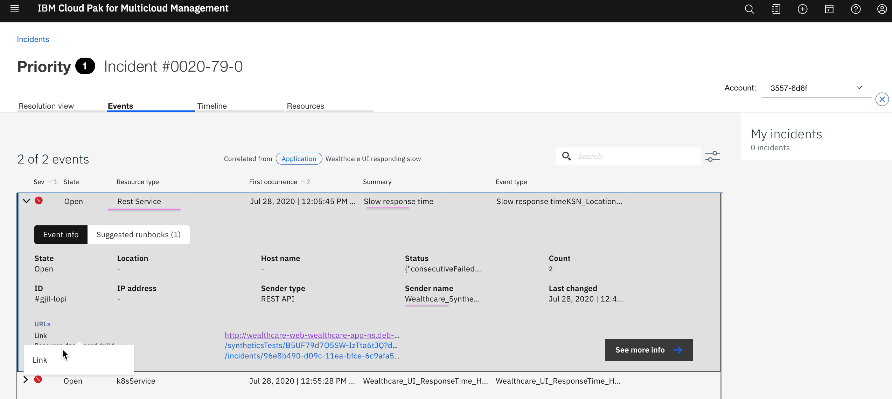
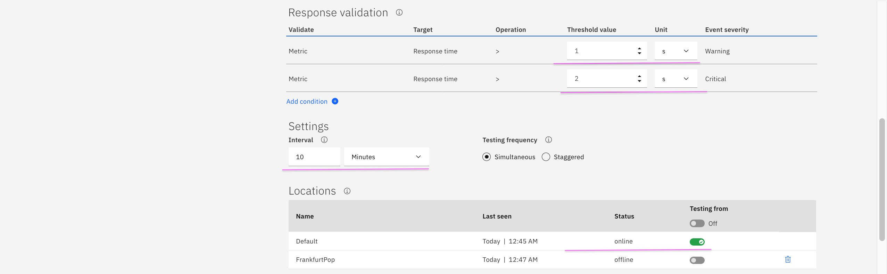

# MCM Monitoring Configuration for usecase - Web UI Responding Slow

MCM leverages the following objects for Application Monitoring and Incident management.
- Thresholds
- Synthetic Tests
- Runbooks
- Event Policies
- Incident Policies

This document explains about how to create and configure those objects for an use case `Web UI Responding Slow`.

Here is the usecase and incident handling flow.


## 1. Incident - Web UI Responding Slow

We are going to create and configure the following.

- Threshold for `Web UI service Response time high`
- Synthetic test for `Web UI service`
- Runbook for `How to Increase POD replica`
- Event Policies for `Web UI Response time high`
- Incident Policies for `Web UI Response time high`

Here is the sample incident with events and runbook.

#### Incident Summary


#### Incident Details - Events list


#### Incident Details - Synthetic Test Event



#### Incident Details - Web UI Response time high Event


#### Incident Details - Runbook associated


#### Incident Details - Runbook associated


--------

## 2. Goto Administration Page in MCM Console

Click on the `Infrastructure Monitoring`


--------

## 3. Configuring Threshold

#### Goto Threshold Page

Click on the `Threshold` card


#### Create Threshold for `Web UI service Response time high`

Here is the list of threshold created. You can click on `Create` button to create new.


Here is the threshold configuration for `Web UI service response time high`.

Enter the parameters as highlighted.


--------


## 4. Configuring Synthetic Test

#### Goto Synthetic test Page

Click on the `Synthetic` card


#### Create Synthetic test for `Web UI service`

Here is the list of Synthetic Test created. You can click on `Create` button to create new.


Here is the Synthetic Test configuration for `Web UI service`.

Enter the parameters as highlighted.





--------

## 5. Configuring Runbook

#### Goto Runbook Page

Click on the `Runbook` card


#### Create Runbook for `How to Increase POD replica`

Here is the list of Runbook created. You can click on `Create` button to create new.


Here is the Runbook configuration for `How to Increase POD replica`.

Enter the parameters as highlighted.


--------

## 6. Configuring Event Policies

#### Goto Event Policies Page

Click on the `Policies` card


#### Create Event Policies for `Web UI Response time high`

Here is the list of event policies created. You can click on `Create` button to create new.


Here is the Event Policy configuration for `Web UI Response time high`.

Enter the parameters as highlighted.


--------

## 7. Configuring Incident Policies

#### Goto Incident Policies Page

Click on the `Policies` card


#### Create Incident Policies for `Web UI Response time high`

Here is the list of Incident policies created. You can click on `Create` button to create new.


Here is the Incident Policy configuration for `Web UI Response time high`.

Enter the parameters as highlighted.


```
